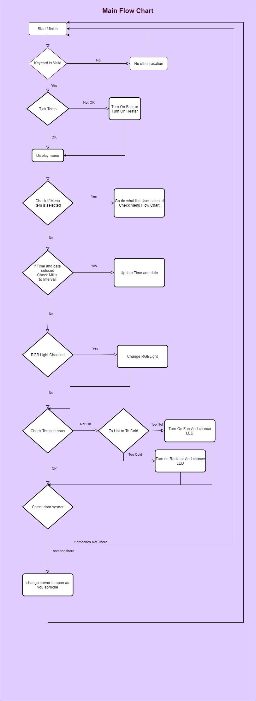

# Det Intelligente Hus

## Introduktion / Motivation

Det intelligente Hus for mig, er at gøre ting så nemt at anvende for den enklete bruge,
og af den grund er dette et udksat af hvad jeg ville mene der skal være i det intelligente hus.
nogle af de ting ville være en central display med en keypad til at kunne ændre temratur, blæser hasighed. Et display til at kunne se tempraturem, tiden, dato, eller andet nytting info. Knapper til at åbne vinduer/ døre. Keycard til at lås døre op. Justerbare RGB LED lys.

Dette er selvfølig kun toppen af det, men neden under har jeg en præciserede liste over det ting jeg gerne vil lave.

Det skal dog siges at dette er kun en prototype på forslag til hvordan fremtidens huse kunne blive til

## Krav

- [X] En NFC key der kan låse døre op (Låser Huset op), og giver adgang til menuen, samt en velkommst.
  - [X] 1 key til at slå op
  - [X] Udksiver en velkoms hvis det er rigtigt
- [X] Display med Menu / en central Hub hvor man ville kunne styre nogle af tingende i huset.
  - [X] En Keypad til at kunne kontorllere og vælge ting i Menuen.
  - [X] LCD displays som cykler gennem fx. dato, tid og tempratur, efter hvad man vælger i menuen.
- [X] en tempratur sensor / humidity sensor.
  - [X] en blæser der styres af tempraturen.
  - [X] En Rød LED for at visualisere at en rediator bliver tændt
- [X] RGB LED som kan styres for hver farve.
- [X] afstands sensor til at åbne døre når du er tæt nok på.

### Eventuelle tilføjelser hvis der bliver tid til dem

- [ ] Man kan ændre på hvad den perfekte temp er så blæser og radiater slukker og tænder efter det
- [ ] Man Kan Låse døre op med fler Key cards
- [ ] RGB LED kan også blive styret i menuen. 
- [ ] Manuelt styre blæser fra menuen.
- [ ] knapper til at styre servo og åbne og lukke vinduer.
- [ ] Man kan vælge og tilføjde et nyt keycard der kan låse op
- [ ] RGB LED tænder og slukker efter hvor lydst det er

## Solution

Jeg har i dette projekt fokuseret på at kunne have tid til at fordybe mig i de enkelte emner jeg har udvalgt i kravendne.

Med henblik på at sætte det hele op så det der let at kunne lave ændringer og tilføje nye elementer i programmet.
Derfor har jeg valgt at bruge FBF Folder By Feature strukturen 

### Video af borads

## Hardware Details

Til dette projekt er der blevet brugt en Elegoo MEGA2560 R3, og en ATATMEL-ICE-BASIC som bliver brugt til Debuggeing af koden.

Yderliger skal der bruges følgende:

- Fan Blade
- DC Moter
- L293D
- Power Suply Moduel
- Doide Rectifier
- Keypad
- RFIO-RC522 (NFC / RFID låser)
- LCD Display
- OLED Display
- DS3231 
- DHT11
- RGB LED
- Rød, Grøn, Blå singe LED
- 6 220 Ohm Modstand
- 4 Potentiometeres
- Servo moter
- HC-SR04 ultralyds sensor
- en masse ledninger

### Pins

- DHT11: Pin 2
- HC-SR04: Triger Pin 3, Echo Pin 4
- LCD
    - LCD RS pin to digital pin 22
    - LCD Enable pin (E) to digital pin 23
    - LCD D4 pin to digital pin 24
    - LCD D5 pin to digital pin 25
    - LCD D6 pin to digital pin 26
    - LCD D7 pin to digital pin 27
    - LCD R/W pin to ground
    - LCD VSS pin to ground
    - LCD VCC/VDD pin to 5V
    - 10K resistor:
    - ends to +5V and ground
    - wiper to LCD VO
- Light
    - RedRGB pin 42
    - GreenRGB pin 43
    - BlueRGB pin 44
    - RedLED pin 9
    - GreenLED pin 7
    - BlueLED pin 8
- DC moter Pin 12
- Keypad:
    - rowPins: 32, 33, 34, 35 //connect to the row pinouts of the keypad
    - colPins: 36, 37, 38, 39 //connect to the column pinouts of the keypad
- NFC / RFID
    - RST_PIN   5
    - SS_PIN    53
- servopin pin 10
- OLED pin 20,21 (SCL og SDA)
- Real time clock pin SCL og SDA

## Tools

[Microchip Studio for AVR and SAM Devices 7.0.2542](https://www.microchip.com/en-us/development-tools-tools-and-software/microchip-studio-for-avr-and-sam-devices#Downloads)

[Draw.io](https://app.diagrams.net/)

[Visual Studio Code version 1.56](https://code.visualstudio.com/)

[Git 2.31.1](https://git-scm.com/downloads)

## Librayes
| Libraries                                                                                | Version |
| :--------------------------------------------------------------------------------------- | ------- |
| [Adafruit_BusIO](https://github.com/adafruit/Adafruit_BusIO)                             | 1.7.3   |
| [Adafruit_GFX_Library](https://github.com/adafruit/Adafruit-GFX-Library)                 | 1.10.10 |
| [Adafruit_SSD1306](https://github.com/adafruit/Adafruit_SSD1306)                         | 2.4.5   |
| [AdaFruit_unified_sensor](https://github.com/adafruit/Adafruit_Sensor)                   | 1.1.4   |
| [DHT_sesnor_libaray](https://github.com/adafruit/DHT-sensor-library)                     | 1.4.2   |
| [DS3231](https://github.com/jarzebski/Arduino-DS3231)                                    | 1.0.7   |
| [Keypad](https://playground.arduino.cc/Code/Keypad/)                                     | 1.0.2   |
| [LiquidCrystal](https://www.arduino.cc/en/Reference/LiquidCrystal)                       | 1.0.7   |
| [MFRC522](https://github.com/miguelbalboa/rfid)                                          | 1.4.8   |
| [Servo](https://www.arduino.cc/reference/en/libraries/servo/)                            | 1.1.7   |
| [SPI](https://www.arduino.cc/en/reference/SPI)                                           |         |
| [TimerOne](https://playground.arduino.cc/Code/Timer1/)                                   | 1.1.0   |
| [TimerThree](https://playground.arduino.cc/Code/Timer1/)                                 | 1.1.0   |
| [Wire](https://www.arduino.cc/en/reference/wire)                                         |         |
| [HCSR04-ultrasonic-sensor-lib](https://github.com/gamegine/HCSR04-ultrasonic-sensor-lib) | 2.2.0   |

## Diagramer

Et Overblick over selve programet

Som set på Flow Charted er dette det main loop
hvor den vil stå og kører igennem

Dette er en oversigt over selve Menuen

## Logic Analyser
 

### I2C (OLED Display)

1. start Bit (SS SCL)
2. først 7 bit 
3. read write bit
4. Ack or Nak
5. Master Read/ write

### SPI (NFC / RFID Reader)
CPOL = 0 CPHA = 0

### Singel Wire (1 Wire) (DHT11 Tempratur And HUmidity sensor)
1. MCU sends out start signal (low)
2. Pull up and wait for sensor
3. DHT respons (low)
4. DHT Pull up (get ready to read data)
5. DHT send 40 Bit
6. sensor pulls down to complet 

## Deployment

1. conenct both cabels to the Atmel and Mega2560
2. right click your projekt, go to properties, finde tools, and selcet Atmel and JTAG in the to dopedowns, save and close
3. hit start without debugging, and let it uplode, an check that it is succesfull

## Responsible People  

|Name|E-mail|Role|
|-|-|-|
|Peter Hymoller|Peter.hymoeller@hotmail.dk|Developer|
|Egon Christian Rasmussen|ecr@eucsyd.dk|Product Owner|
